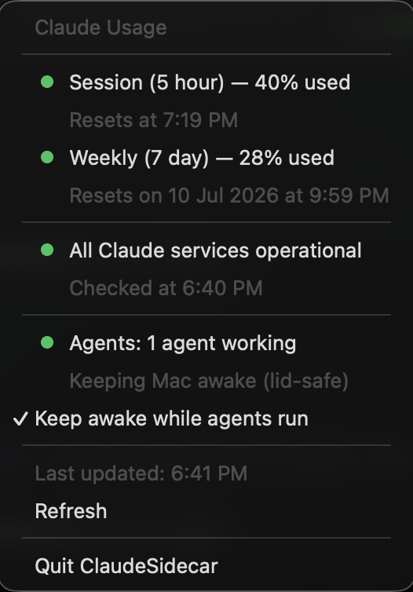

# claude-sidecar

A tiny macOS menu-bar app (Go) that shows your Claude Code rate-limit usage. It shows the same **5h** and **7d** numbers `/usage` and `ccstatusline` show, but always visible in the menu bar instead of in the terminal.

```
  ✳ 23%
```

The menu bar shows a colour-coded sparkle and your **session (5-hour)** percentage. Click it for the rest: every window's exact percentage, when each one resets, the 7-day Sonnet window when your account has it, Anthropic's live service status, and a manual refresh.

<p align="center">
  
</p>

It also keeps your Mac awake while a Claude Code agent is working, even with the lid closed. See [Keep awake while agents run](#keep-awake-while-agents-run).

> Not affiliated with Anthropic. It reads an undocumented endpoint, so it can break when that endpoint changes.

## What it shows

Menu bar: an eight-pointed sparkle drawn at runtime, then the session (5-hour) percentage, like `✳ 23%`. The weekly windows don't show here. They live in the dropdown. The sparkle colour tracks the session percentage:

| Session | Colour |
|---|---|
| under 70% | green `#22C45E` |
| 70 to 89% | yellow `#FFCC00` |
| 90% or more | red `#FF3B30` |

Dropdown: one block per window. A coloured dot sits next to `Session (5 hour) — 23% used`, over the reset time (`Resets at 7:59 AM`, or `Resets on 31 Jan 2026 at 7:59 AM` for the weekly windows). The Sonnet row stays hidden unless your account reports that window.

## How it gets the data

It calls the same undocumented endpoint Claude Code uses:

```
GET https://api.anthropic.com/api/oauth/usage
    Authorization: Bearer <oauth access token>
    anthropic-beta: oauth-2025-04-20
    User-Agent:     claude-code/<version>
```

- The OAuth token is read fresh on every poll, so token refreshes get picked up. It comes from `~/.claude/.credentials.json` (`claudeAiOauth.accessToken`), and falls back to the macOS Keychain item `Claude Code-credentials`.
- The `User-Agent` has to look like Claude Code. Without it the endpoint returns `429` fast.
- Response shape: `{ five_hour | seven_day | seven_day_sonnet: { utilization, resets_at } }`, where `utilization` is a 0 to 100 percentage.

The token never leaves your machine and is never logged. The 5h and 7d segments only show up for Claude Pro and Max accounts.

## Claude status

Below the usage rows, a **Claude Status** block reports whether Anthropic's services are actually up. That way a stalled session reads as an outage instead of your own network. It looks like the usage rows, a dot over a detail line:

```
● All Claude services operational
  Checked at 8:39 PM
```

During an incident it shows the incident title over the components it affects:

```
● Elevated errors on Claude Code
  Affects: Claude Code (partial outage), Claude API (api.anthropic.com) (degraded)
```

The dot colour follows the worst affected component: green (operational), yellow (degraded or maintenance), orange (partial outage), red (major outage). Clicking the row opens <https://status.claude.com>.

Status comes from Anthropic's public [Statuspage](https://status.claude.com), polled every 5 minutes with no auth:

```
GET https://status.claude.com/api/v2/summary.json
```

(`status.anthropic.com` redirects there.) Those two GETs are the only network traffic the app makes.

Two deliberate choices differ from the page's own banner:

- **The dot follows components, not the page-level indicator.** A page-level incident with no component attached leaves the dot green. Only a component Statuspage marks as non-operational turns it.
- **`Claude for Government` is ignored.** This bar has no settings pane, so it hard-codes that default instead of showing an outage on an endpoint you almost certainly can't reach.

If the status endpoint is unreachable, the last reading stays on screen. Its `Checked at …` line is the time of that reading, not of the failed attempt. Same for usage: on a transient error (offline or 429) the last good reading stays, and the "Last updated" line says why it's stale. A missing or expired token greys the sparkle and shows `—`, with what to do in the dropdown and tooltip.

## Build and run

You need Go and the Xcode command-line tools (cgo, for the menu bar).

```sh
make run             # build and run in the foreground (Ctrl-C to stop)
make once            # print the raw usage JSON once and exit (debugging)
make status          # print the service-status menu lines once and exit (debugging)
make app             # bundle build/ClaudeSidecar.app, then: open build/ClaudeSidecar.app
make install-agent   # copy to ~/Applications and launch at login
make uninstall-agent
make install-sleepd    # root LaunchDaemon for keep-awake (needs sudo, see below)
make uninstall-sleepd
make install-hooks     # Claude Code hooks for agent detection (see below)
make uninstall-hooks
make uninstall-all     # uninstall-hooks, uninstall-sleepd, uninstall-agent, in order
```

## Config

- `CLAUDE_USAGE_INTERVAL` sets the usage poll interval in seconds. Default `60`, minimum `15`. Keep it gentle. The endpoint is rate-limited.
- `CLAUDE_USAGE_BATT_MIN` sets the battery cutoff for keep-awake. Default `20`, clamped `5` to `80`. See below.

## Keep awake while agents run

The menu bar has a block below Claude Status:

```
● Agents: 2 agents working
  Keeping Mac awake (lid-safe)
  ☑ Keep awake while agents run
```

While a Claude Code agent is actively working, this app can keep the Mac from sleeping even with the lid closed. Then it lets the Mac sleep again the moment every agent goes idle. "Working" means mid-turn: between you submitting a prompt and its `Stop` hook firing, not just "a `claude` process exists".

`caffeinate` can't do this. The only thing that survives a closed lid with no external display is macOS's `SleepDisabled` flag (`pmset -a disablesleep 1`), and that needs root.

How it works, end to end:

- Claude Code hooks write one small JSON file per session under `/Users/Shared/claude-sidecar/sessions/`. `UserPromptSubmit`, `PreToolUse`, and `PostToolUse` mean running. `Stop` means idle. `Notification` means blocked. `SessionEnd` means gone. This app polls that directory every 5 seconds and rolls it up into the "Agents: …" row.
- While at least one agent runs, the feature is on, and the battery is OK, the app writes a heartbeat file `/Users/Shared/claude-sidecar/keepawake.state` every 30 seconds.
- A root `LaunchDaemon` polls that heartbeat every 30 seconds and flips `pmset -a disablesleep` to match. If the heartbeat goes stale for more than 90 seconds (app crashed, Mac slept, whatever), the daemon turns `disablesleep` back off on its own. It's a watchdog, so a crashed app can never wedge the Mac's sleep behavior for good. A reboot clears the flag too.
- **Battery cutoff.** On battery, keep-awake is refused once charge drops to or below `CLAUDE_USAGE_BATT_MIN` (default `20`, clamped `5` to `80`). The app and the root daemon both enforce this on their own. The detail line shows `Paused — battery X% (≤ N% cutoff)` when that's why the Mac isn't being kept awake.
- The checkbox **"Keep awake while agents run"** is the on/off switch. Default on, saved to `/Users/Shared/claude-sidecar/config.json`.

### Install

Three steps, **in this order**. Each one depends on the one before it:

```sh
make install-agent          # the app itself (hooks point at its installed path)
sudo make install-sleepd    # the root LaunchDaemon that can actually disable sleep
make install-hooks          # merges hook entries into ~/.claude/settings.json
```

Claude Code snapshots its hook config **at session start**. Hooks installed while a `claude` session is already open never fire in that session. Start a **new** session after `make install-hooks` before expecting any of this to do anything.

If you skip `install-sleepd`, the rest still runs fine. The "Agents: …" row still tracks sessions, but the detail line reads `Sleep helper not installed` and nothing ever calls `pmset`.

### Teardown

Reverse order, so `~/.claude/settings.json` is never left pointing at a binary you're about to delete:

```sh
make uninstall-hooks
sudo make uninstall-sleepd   # needs sudo, also restores normal sleep right away
make uninstall-agent
```

Or just `sudo make uninstall-all`. It runs `uninstall-hooks`, `uninstall-sleepd`, `uninstall-agent` in that order. `uninstall-sleepd` still needs sudo, so run the whole thing with sudo.

### Read this before trusting it unattended

- **Esc doesn't fire `Stop`.** Claude Code has no hook for "user cancelled". An interrupted session keeps recording `state=running` with a live PID, so the Mac can stay awake until the next turn, `SessionEnd`, or a 24-hour hard cap. There's a partial self-heal: Claude Code's own "waiting for your input" notification fires the `Notification` hook after the session goes quiet (about 60 seconds), which flips the session to `blocked`. That depends on idle notifications being enabled, and it isn't instant.
- **Lid closed plus heavy load in a bag is a heat risk.** Disabling sleep disables sleep. There's no "but not if it's hot" logic. The battery threshold is the only real guard. Don't rely on this for a MacBook zipped into a bag on a long trip unless you trust the battery cutoff and your bag's airflow.
- **`/Users/Shared` is world-writable.** Any local account on the machine could forge a session file and hold the Mac awake, or tamper with the heartbeat. That's an accepted trade-off for a single-user personal machine, not something this is engineered around.
- **The daemon is deliberately exclusive.** It re-evaluates and re-applies its target every 30 seconds. So it will revert any other tool's (or your own manual) `pmset -a disablesleep 1` within 30 seconds while installed. That's by design — don't run it alongside another tool that manages the same `disablesleep` flag.
- **Notification permission.** The "Keeping Mac awake", "battery low", and "all agents finished" notifications go through `osascript`, which macOS attributes to **Script Editor**. They can be silently suppressed until you grant Script Editor notification permission in System Settings. Nothing here depends on the notification showing up. Treat it as a bonus, not a status indicator.

## Troubleshooting

- **Grey sparkle and `—` right after installing as an agent.** If your token lives in the Keychain (the macOS default) instead of `~/.claude/.credentials.json`, the first `security` read from the relocated, unsigned `ClaudeSidecar.app` is a different code identity than your terminal. So macOS may pop a Keychain prompt. Click **Always Allow**. A denied prompt shows up as the generic "no token found" message.
- **Stuck on "rate-limited".** Usually the `User-Agent` version drifted and the endpoint is refusing it. Rebuild so it re-detects your installed `claude --version`, or bump the fallback in `detectUserAgent`.

## Credits

The menu-bar sparkle geometry and the green/threshold colour scheme are derived from [Artzainnn/ClaudeUsageBar](https://github.com/Artzainnn/ClaudeUsageBar) (MIT-licensed), so the two bars read the same at a glance. The yellow and red are Apple system colours; the orange service-status and grey idle states are this app's own. ClaudeUsageBar's copyright notice is preserved in [LICENSE](LICENSE).

## License

[MIT](LICENSE).
